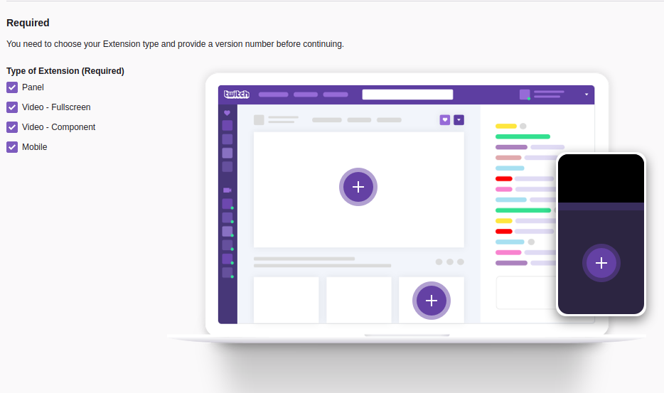
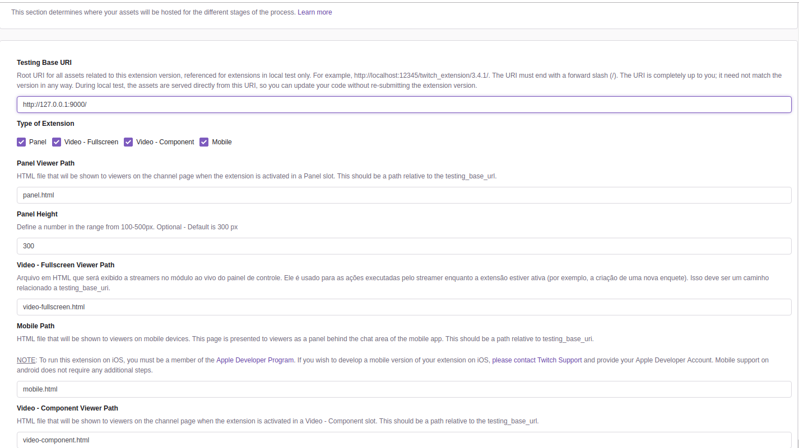
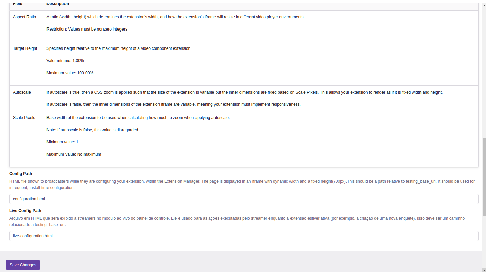
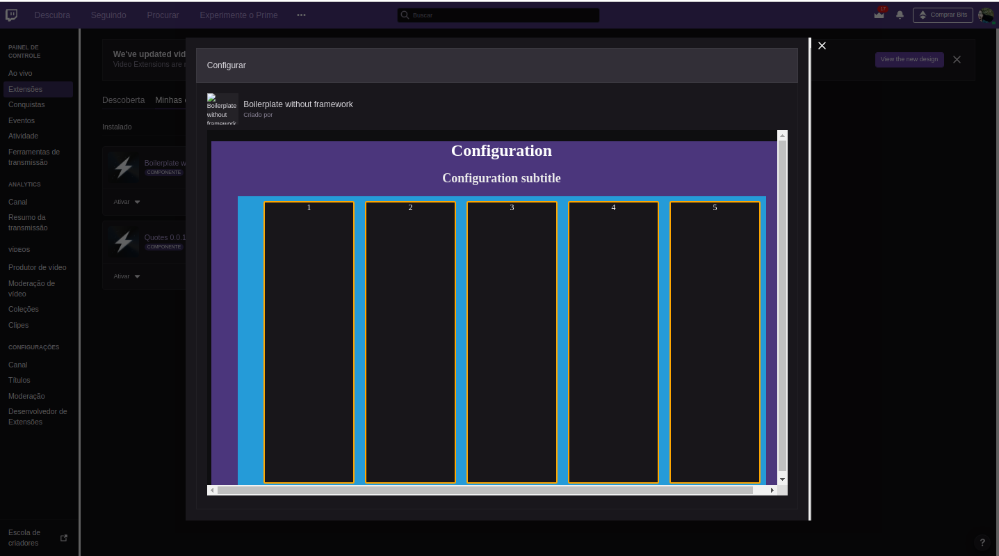
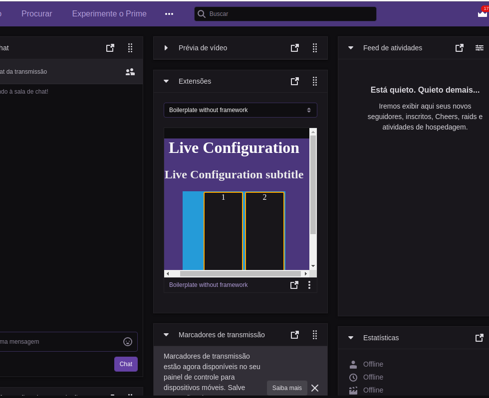
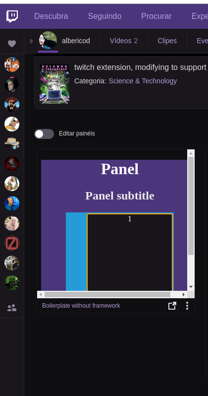

### About

This is an opinionated structure for creating twitch extensions without using js frameworks (React, Vue, Angular ....), it is a structure that can easily support any famous structure if the complexity of its extension increases.

### Installation

requires [Node.js](https://nodejs.org/) to run.

### Twitch Extension Without Frameworks - Install Dependencies

```sh
$ git clone https://github.com/AlbericoD/twitch-extension-without-js-framework.git
$ cd twitch-extension-without-js-framework
$ npm install
```

---

### Start - Dev Mode

```sh
$ cd twitch-extension-without-js-framework
$ npm start
```

```
Browser:

[configuration] http://localhost:9000/configuration.html
[live-configuration] http://localhost:9000/live-configuration.html
[panel] http://localhost:9000/panel.html
[video-component] http://localhost:9000/video-component.
[video-fullscreen] http://localhost:9000/video-fullscreen.html
[mobile] http://localhost:9000/mobile.html
```

---

### create a build folder

```sh
$ cd twitch-extension-without-js-framework
$ npm run build
```

```sh
Builds the extension for production to the build folder.
It correctly bundles twitch extension in production mode and optimizes the build for the best performance.
The build is minified and the filenames include the hashes.
The extension is ready to be deployed!
```

---

### Prepare to Review

Linux user:

```sh
$ cd twitch-extension-without-js-framework
$ npm run review-twitch
```

```sh
this command executes the build script and then compresses all the files in the build folder to a build.zip

if this command does not work on your S.O, use the way your S.O makes use, there is an example of the zip file inside the build folder
```

### Configuration Extension In Twitch Dev Console

`got to https://dev.twitch.tv/console/extensions`

- Choose extension type:
  

- asset-hosting tab
  
  

---

### Deploy to Twitch

`got to https://dev.twitch.tv/console/extensions`

- click manage on the name of your extension
- click in files
- choose your Build.zip, then click uplod assets
- click in status
- choose move to hosted test, test and put in review after you test everything

- final:
  
  
  
